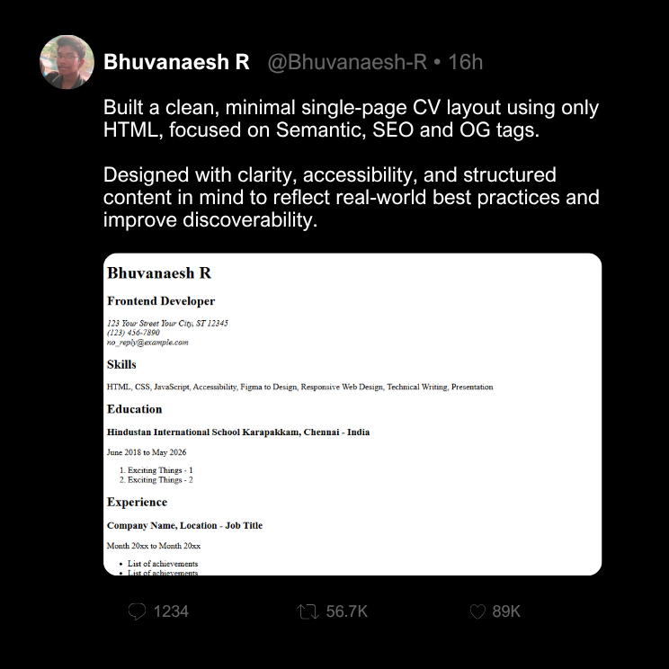

# Developer Roadmap Projects

### By Bhuvanaesh R

A collection of projects built by following the roadmap from [**roadmap.sh**](https://roadmap.sh/)  
This repository documents my journey of mastering different domains in software development through hands-on projects.

---

## 🤝 Contribution

This is a personal learning repository, but suggestions and improvements are always welcome!

---

## 🔗 Frontend Projects List (roadmap.sh)

Below are the original project references from roadmap.sh:

- [Single Page CV](https://roadmap.sh/projects/single-page-cv)

Click any of the images below to view the project folder

  

