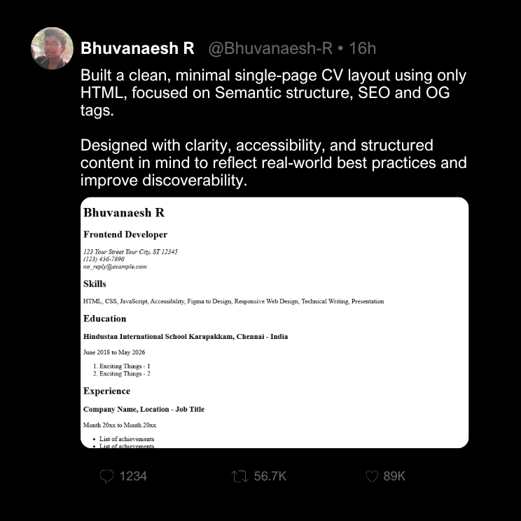

# 🎯 Frontend Projects Collection

A curated collection of frontend projects built by following the roadmap from [**roadmap.sh**](https://roadmap.sh/).  
These projects are part of my journey to strengthen core frontend skills, improve problem-solving, and build real-world UI/UX implementations.

---

## 🤝 Contribution

This is a personal learning repository, but suggestions and improvements are always welcome!

---

## 🔗 Projects List (roadmap.sh)

Below are the original project references from roadmap.sh:

- [Single Page CV](https://roadmap.sh/projects/single-page-cv)

Click any of the images below to view the project folder

  

